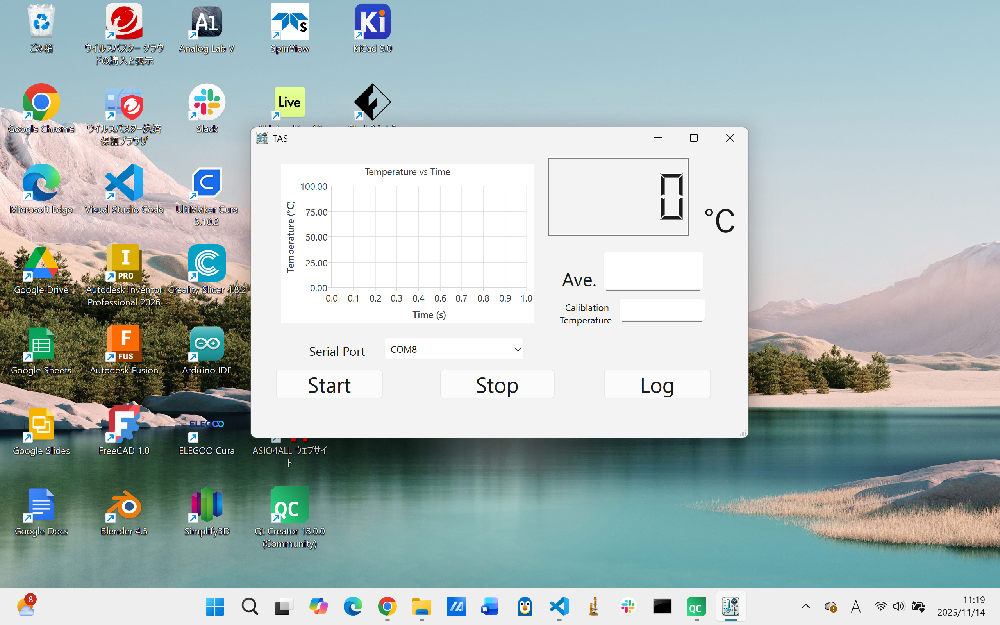
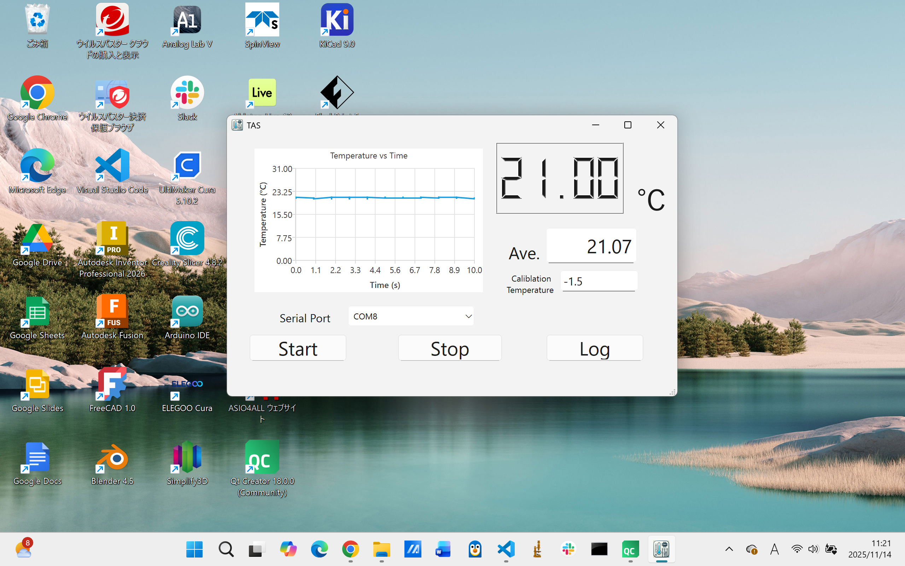

# 🌡️ TAS — Temperature Acquisition System

> 🌟 **TAS（Temperature Acquisition System）** は、  
> **MAX6675 ＋ K 型熱電対** を使ったリアルタイム温度計測・ロギングアプリです。  
> Qt（C++）で構築されたデスクトップアプリとして動作し、  
> Arduino UNO R4 から温度データをシリアル通信で取得します。

---

## 🖥️ アプリ概要

|        起動画面        |      Arduino 接続時      |
| :-------------------: | :----------------------: |
|  |  |

---

## 🔥 主な機能

以下は Qt アプリ（`mainwindow.cpp`）で実装されている主要要素です。

| カテゴリ | 主な内容 |
|---------|---------|
| 🪟 **UI・レイアウト** | - アプリタイトルを `TAS` に設定<br>- 自動リサイズ |
| 🔌 **シリアル通信** | - `QSerialPort` による Arduino UNO R4 接続<br>- ポート自動列挙<br>- ボーレート設定（9600） |
| 🌡️ **温度表示** | - MAX6675など から受信した温度をリアルタイム表示<br>- ℃表示、エラーチェックあり |
| 📝 **ロギング** | - `.csv` 保存<br>- タイムスタンプ付き温度ログ<br>- ログファイル自動生成 |
| 📈 **グラフ表示** | - QtCharts によるリアルタイムプロット |
| 🎛️ **操作性** | - Enter キー対応、タブ順設定<br>- メニュー/ショートカット対応 |

---

## 🔌 Arduino 連携

Arduino UNO R4 が MAX6675 から温度を取得し、  
**シリアル通信で PC に送信**します。

### 📄 スケッチの場所

```
arduino/TAS_MAX6675_Logger/TAS_MAX6675_Logger.ino
```

### 📡 シリアル通信仕様

| 項目 | 値 |
|------|------|
| **ボーレート** | 9600 |
| **送信フォーマット** | `25.00`（浮動小数、℃） |

---

## 🛠 回路図（KiCad 8）
<p align="center">
  
</p>

---

## 📂 プロジェクト構成

```plaintext
TAS/
├─ app/
│   ├─ main.cpp
│   ├─ mainwindow.cpp
│   ├─ mainwindow.h
│   ├─ mainwindow.ui
│   ├─ TAS.pro
│   ├─ resource.qrc
│   ├─ icon/
│   │   └─ appicon.rc
│   └─ ...
│
├─ arduino/
│   └─ TAS_MAX6675_Logger/
│       └─ TAS_MAX6675_Logger.ino
│
├─ kicad/
│   └─ TAS/
│       ├─ symbols/
│       ├─ TAS_schematic.pdf
│       ├─ TAS_schematic.svg
│       ├─ TAS_schematic_trimmed.svg
│       └─ TAS.kicad_pcb
│
├─ images/
│   ├─ app_startup.png
│   └─ running_with_arduino.png
│
└─ README.md
```

---

## 🛠 ビルド手順

### ✔ 必要環境

- Qt 6.5 以降（QtSerialPort 必須）
- C++17 対応コンパイラ
- Arduino IDE

### ✔ Qt アプリビルド手順

1. `app/TAS.pro` を Qt Creator で開く  
2. キットを選択（Desktop Qt 6.6 など）  
3. qmake を実行  
4. ビルドする  
5. `build/` に `TAS.exe` が生成される  

---

## 📄 ライセンス

このプロジェクトは [MIT License](LICENSE) のもとで公開されています。
